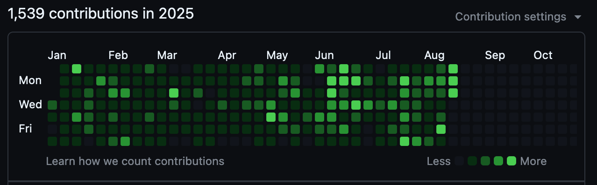
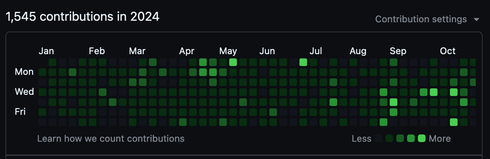
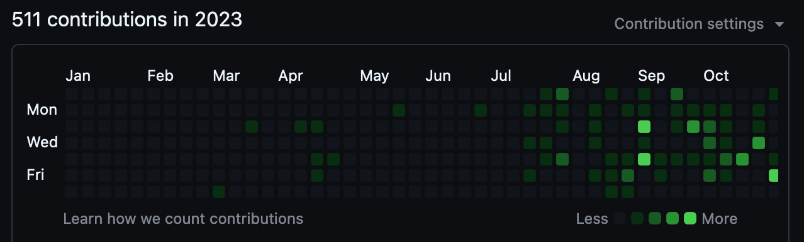

_A 1910 oil [painting](https://commons.wikimedia.org/wiki/File:Alexander_rothaug,_ulisse,_nostalgia_della_patria,_1910_(the_jack_daulton_collection)_02.jpg) called_
Odysseus’ Homesickness _by [Alexander Rothaug](https://de.wikipedia.org/wiki/Alexander_Rothaug) (March 13, 1870 — March 5, 1946)._

# Welcome!

> [!NOTE]
>
> This repository contains some information about my work and GitHub activity. Means of contacting me are also provided.

 Overview Of Public, Non-Work Repositories 

## Active

| Repository &emsp;| Description | Stars |
|:---|:---|:---|
| [`O957 `](https://github.com/O957/O957) | The author's personal GitHub profile. Contained therein are some resources and decisions that the author has made concerning his use of GitHub. This repository exists as a place for onlookers to provide the author with feedback.  | 0 |
| [`O957-Template`](https://github.com/O957/O957-Template) | A template I find useful for setting up Python and R repositories.  | 1 |
| [`paleo-labels`](https://github.com/O957/paleo-labels) | A Python package for writing precisely formatted labels for natural specimens and related items, such as collections and excursions. | 4 |
| [`Anki-Decks`](https://github.com/O957/Anki-Decks) | The author's personal Anki workflow, making use of genanki.  | 0 |
| [`Re-Wittmann-TDWMFC-2024`](https://github.com/O957/Re-Wittmann-TDWMFC-2024) | A partial replication in Python of the 2024 paper (The Demographic-Wealth model for cliodynamics) by Wittmann and Kuehn.   | 0 |
| [`Programming-Protocols`](https://github.com/O957/Programming-Protocols) | Protocols for programming that I attempt to abide by.   | 0 |
| [`Genetic-Evolution-Tournament`](https://github.com/O957/Genetic-Evolution-Tournament) | A Metaculus human judgment forecasting tournament established to generate forecasts and scenarios pertaining to the use of human genetic and reproductive technologies for treatment and enhancement. (Note: this has been transferred to another individual)  | 6 |

## Stale

| Repository &emsp;| Description | Stars |
|:---|:---|:---|
| [`Quarto-Website-Materials`](https://github.com/O957/Quarto-Website-Materials) | Templates for Quarto websites (blog pages, projects, and data visualization dashboards) for the author to reference in his work.   | 0 |
| [`Personal-Helpers`](https://github.com/O957/Personal-Helpers) | The author's various templates for tasks in research and data science.   | 0 |
| [`Forecasting-Tornadoes `](https://github.com/O957/Forecasting-Tornadoes) | The authors' attempts at forecasting and modelling tornados in the US.   | 3 |
| [`Historical-Dynamics-Python`](https://github.com/O957/Historical-Dynamics-Python) | Implementations in Python using Diffrax of the models described in Peter Turchin's 2003 book Historical Dynamics.    | 1 |
| [`Mathematics-Artwork`](https://github.com/O957/Mathematics-Artwork) | The author's personal mathematical artworks.  | 0 |
| [`Aggregated-Model-Descriptions`](https://github.com/O957/Aggregated-Model-Descriptions) | This repository contains a website with descriptions and some documentation for models that the author and friends have built.  | 0 |

 Overview Of Public, Work Repositories 

| Repository &emsp;| Description | Role | Stars |
|:---|:---|:---|:---|
| [`forecasttools-py`](https://github.com/CDCgov/forecasttools-py) | A Python package for common pre- and post-processing operations done by CFA Predict for short term forecasting, nowcasting, and scenario modeling. | Admin | 7 |
| [`pyrenew`](https://github.com/CDCgov/PyRenew) | Python package for multi-signal Bayesian renewal modeling with JAX and NumPyro. | Developer | 17 |
| [`pyrenew-flu-light`](https://github.com/CDCgov/pyrenew-flu-light) | A replication in Python and PyRenew of a renewal model written in Epidemia for forecasting influenza hospital admissions. | Admin | 1 |
| [`covid19-forecast-hub `](https://github.com/CDCgov/covid19-forecast-hub) | A repository run by the US CDC to collect forecasts of weekly incident COVID-19 hospital admissions.  | Developer | 17 |
| [`hubverse-annotator`](https://github.com/CDCgov/hubverse-annotator) | Locally-hosted web application for visualization of hubverse formatted observations and model forecasts and for annotation of data and models. | Admin | 3|
| [`rsv-forecast-hub `](https://github.com/CDCgov/rsv-forecast-hub) | A repository run by the Centers for Disease Control and Prevention (CDC) to collect forecasts of weekly incident respiratory syncytial virus (RSV) hospitalizations.  | Admin | 1 |

 External Repositories I Have Contributed To 

| Repository &emsp;| Description |
|:---|:---|
| [`longevity-paper`](https://github.com/willtownes/longevity-paper) | Supporting code for the paper "Identifying Longevity Associated Genes by Integrating Gene Expression and Curated Annotations". |
| [`paleobioDB`](https://github.com/ropensci/paleobioDB) | R interface to the Paleobiology Database. |
| [`rphylopic`](https://github.com/palaeoverse/rphylopic) | Get Silhouettes of Organisms from PhyloPic.  |
| [`hubTemplate`](https://github.com/hubverse-org/hubTemplate) | Hubverse repository template. |
| [`pylabrobot`](https://github.com/PyLabRobot/pylabrobot) | interactive & hardware agnostic SDK for lab automation. |
| [`covid19-forecast-hub`](https://github.com/CDCgov/covid19-forecast-hub) | A repository run by the US CDC to collect forecasts of weekly incident COVID-19 hospital admissions.  |
| [`FluSight-forecast-hub`](https://github.com/cdcepi/FluSight-forecast-hub) | A repository to collect forecasts of weekly incident influenza hospital admissions. |

 Contributions Over The Years On GitHub 

 

 2025 

 

 2024 

 

 2023 

 

 Contact Me 

 

To contact me with (greetings / criticism / advice / other remarks):

* Email [my-username] + [at-symbol] + [proton] + [dot-symbol] + [me]

Feel free also to create an [issue](https://github.com/O957/O957/issues) or [pull request](https://github.com/O957/O957/pulls) into this repository with (greetings / criticism / advice / other remarks).

I am open to conversation and co-working and to conducting data science projects (in geology, paleontology, genetics, human reproduction, metascience, cliodynamics, forecasting, AI safety) together.

